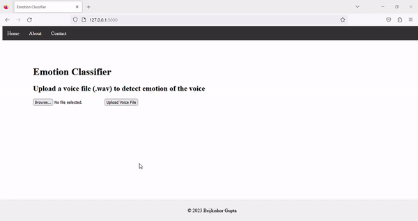

# Speech Emotion Detection Using MLP and SVM

This project focuses on developing a system for speech emotion detection using the Multi-Layer Perceptron (MLP) and Support Vector Machine (SVM) algorithms. The goal is to automatically detect emotions from speech signals.

## Table of Contents
- [Introduction](#introduction)
- [Dataset](#dataset)
- [Feature Extraction](#feature-extraction)
- [Model Training](#model-training)
- [Evaluation](#evaluation)
- [Usage](#usage)
- [Conclusion](#conclusion)

## Introduction
The "Speech Emotion Detection Using MLP and SVM" project aims to utilize machine learning algorithms to analyze speech signals and classify them into different emotional states. Emotion detection from speech has various applications, such as sentiment analysis, human-computer interaction, and mental health monitoring.

The project implements the MLP and SVM algorithms to perform the task of speech emotion detection. These algorithms are trained on a dataset of labeled speech samples and extract relevant acoustic features from the signals. The extracted features are then used to train separate models for MLP and SVM.
## Dataset
The project uses dataset for speech emotion detection. The dataset consists of speech samples labeled with different emotions, including anger, disgust, fear, happiness, neutral, ps, and sadness. The dataset is loaded and preprocessed to extract the necessary information for feature extraction and model training.

## Feature Extraction
Feature extraction is a crucial step in speech emotion detection. The project utilizes various techniques to extract relevant acoustic features from the speech signals. The features include Mel-Frequency Cepstral Coefficients (MFCCs), chroma features, and mel spectrograms. These features capture the underlying characteristics of the speech signals that are indicative of emotional states.

## Model Training
The MLP and SVM models are trained separately using the extracted acoustic features. The MLP model consists of one or more hidden layers, while the SVM model utilizes a hyperplane to separate different emotional classes. The models are trained on the labeled dataset using appropriate training algorithms and optimization techniques.

## Evaluation
The trained models are evaluated using various metrics such as accuracy, precision, recall, and the F1-score. Cross-validation is performed to assess the models' performance more robustly. Additionally, a confusion matrix is generated to visualize the models' performance across different emotion categories.

The SVM model achieves an accuracy score of 97.86% on the test set, while the MLP model achieves an accuracy score of 99.5%. These results indicate the effectiveness of the trained models in accurately detecting emotions from speech signals.

## Usage
To use the trained models for speech emotion detection, the provided code can be executed. It loads the trained models from the saved files and allows for predicting the emotions of unseen speech samples.

## Conclusion
The "Speech Emotion Detection Using MLP and SVM" project demonstrates the application of machine learning algorithms in speech emotion detection. The trained MLP and SVM models showcase high accuracy in identifying emotions from speech signals. The project can be further expanded by exploring additional feature extraction techniques, experimenting with different models and hyperparameters, and integrating the system into real-world applications.

## Dataset

The dataset used for speech emotion detection is the TESS Toronto emotional speech set data. It consists of speech samples labeled with different emotions, including anger, disgust, fear, happiness, neutral, ps, and sadness.

**Dataset Source:** [TESS Toronto emotional speech set data](https://www.kaggle.com/datasets/ejlok1/toronto-emotional-speech-set-tess)

The dataset can be downloaded from the above link and is publicly available for research purposes.
## Demo




## Installation:
1. Create a Virtual Environment (Optional but Recommended):
It's a good practice to create a virtual environment to isolate the project dependencies. Open your terminal or command prompt and run the following commands:


```bash
  # Create a new virtual environment (replace 'myenv' with your preferred name)
python -m venv myenv

# Activate the virtual environment
# For Windows:
myenv\Scripts\activate
# For macOS/Linux:
source myenv/bin/activate

```

2. Install Required Packages:
With the virtual environment activated, navigate to your project directory that contains the 'requirements.txt' file. Run the following command to install the necessary packages:

```bash
pip install -r requirements.txt

```

3. Start the Flask Application:
Once the packages are installed, run the following command to start the Flask application:

```bash
python app2.py

```

4. Access the Web Application:
Open your web browser and enter the following URL:

```bash
http://127.0.0.1:5000/

```
You should see the "Emotion Classifier" web page, where you can upload a voice file (.wav) to detect the emotion of the voice.